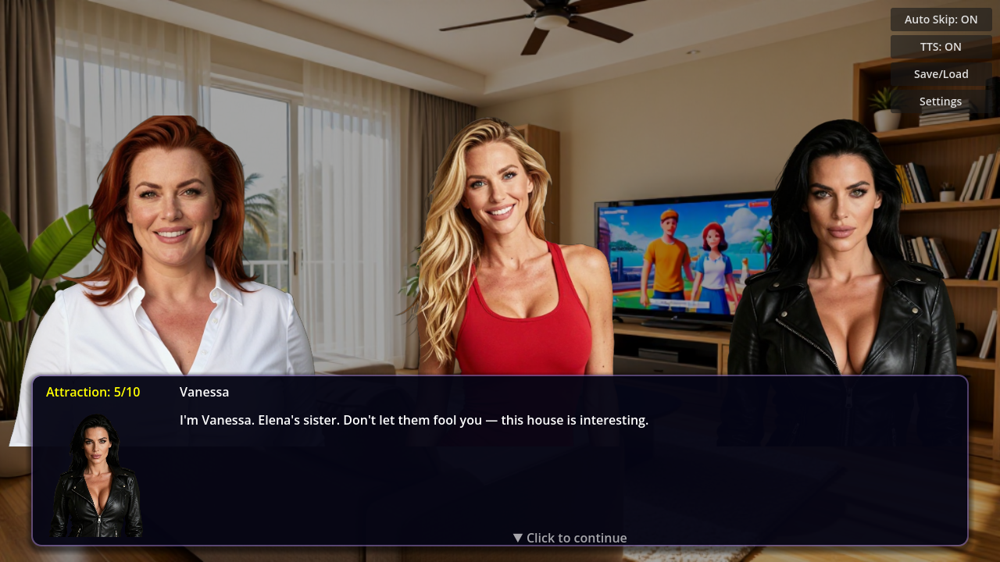
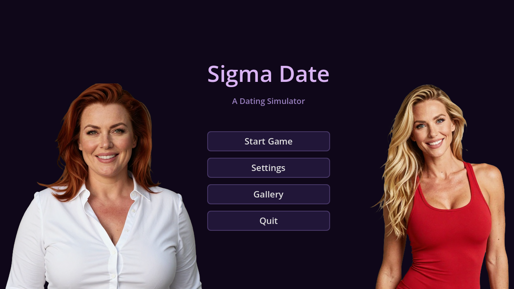

# Godot Dating Sim Starter Kit



A complete, playable **2D visual novel / dating simulator** built in **Godot 4.6** — ready to fork, customize, and make your own. Drop in your own characters, backgrounds, story, and audio to create a unique dating sim in hours instead of weeks.



## Features

- **Signal-based dialogue engine** — `say`, `choices`, `jumps`, `flags`, `labels`, `change_attraction`
- **Multi-route branching** — choice-driven narrative with per-character attraction scores
- **3 save slots** with preview metadata, delete, and continue-from-menu
- **Gallery system** — auto-unlocks portraits, body poses, and backgrounds as players discover them
- **Per-character TTS** — voice line playback via Qwen3-TTS (optional)
- **Audio management** — BGM crossfade, SFX, per-scene music mapping, volume sliders
- **Typing animation** with skip, pulsing continue indicator, narrator mode
- **Click-to-rename characters** — player-customizable speaker names per session
- **Transition effects** — fade-in/out on backgrounds, characters, overlays
- **Settings persistence** — volume levels saved between sessions
- **1359 automated tests** across 7 test suites

## Quick Start

1. Install [Godot 4.6](https://godotengine.org/download)
2. Clone this repo
3. Open `project.godot` in the Godot editor
4. Press **F5** to run — the game loads `scenes/main_menu.tscn`

```
git clone https://github.com/upwardernet/godot-dating-sim-starter-kit.git
```

## Customization Guide

### Add a Character
Edit `scripts/characters.gd` — add an entry to `CHARACTER_DATA`. A new tab appears in the gallery automatically. Drop portrait PNGs in `assets/characters/{name}/`.

```
"yuki": {
    "display_name": "Yuki",
    "accent_color": "#5599ff",
    "portraits": {
        "neutral": "res://assets/characters/yuki/yuki_portrait_neutral.png",
        "happy":   "res://assets/characters/yuki/yuki_portrait_happy.png",
        ...
    },
    "bodies": { ... },
    "tiers": { ... }
}
```

### Add Expressions
Add keys to a character's `"portraits"` dict — new slots appear automatically in the gallery. No UI changes needed.

### Add a Background
Add to `BACKGROUND_PATHS` in `characters.gd`. Unlocked when players encounter it in the story.

### Write Your Story
Edit `data/story.json` with these entry types:

| Type | Purpose |
|------|---------|
| `say` | Dialogue or narration (`"char": ""` for narrator) |
| `choice` | Branching options with jump targets |
| `bg` | Set background (`"id": "living_room"`) |
| `show` | Show character with expression |
| `hide` | Hide character |
| `jump` / `label` | Flow control |
| `flag` | Set story flag |
| `change_attraction` | Modify affection scores |
| `wait` | Pause in seconds |

### Add Music & SFX
Drop MP3s into `assets/audio/bgm/` and `assets/audio/sfx/`. Wire BGM changes in `game.gd:set_background()`.

## Project Structure

```
scenes/          — .tscn files (main_menu, game, dialogue_box, save_load_menu, gallery_menu)
scripts/         — All .gd scripts
data/            — story.json + script.gd (Story autoload)
tests/           — Automated test suite (run with test_runner.tscn)
assets/
  characters/    — {name}/portrait PNGs + body poses + tier images
  backgrounds/   — bg_*.png scene backgrounds
  audio/         — bgm/ and sfx/ MP3s
```

## Architecture

**Autoloads:** `AudioManager`, `Characters`, `DialogueManager`, `Story`, `SaveManager`, `TTSManager`, `GalleryManager`, `Screenshot`

**Signal flow:** `DialogueManager.line_started` → `dialogue_box._on_line_started` → `dialogue_box.line_confirmed` → `DialogueManager.advance()`

The gallery is data-driven from `characters.gd` — adding entries there creates new tabs and slots automatically.

## Requirements

- **Godot 4.6** (GL Compatibility renderer)
- **Windows** (D3D12) — Android export planned

## License

MIT — see [LICENSE](LICENSE)

## Credits

Built with [Godot Engine](https://godotengine.org/). Character and background art generated with ComfyUI (Z-Image-Turbo). BGM and SFX generated with ACE Turbo.
